# DUA in Semantic Segmentation Networks
Implementation of DUA: Dynamic Unsupervised Adaption for Semantic Segmentation Networks. DUA is a method for unsupervised domain adaption. DUA was originally developed by Mirza et al. [Official Repository](https://github.com/jmiemirza/DUA). 
This project implements DUA in Semantic Segmentation Networks. Models were initially trained on Cityscapes and are adapted via DUA on the ACDC dataset. Modelarchitecture is based on code by [Gongfan Fang](https://github.com/VainF/DeepLabV3Plus-Pytorch/tree/master).

# Examples

## 1. Cityscapes Predictions (base model)
72% (mIoU) on CS dataset

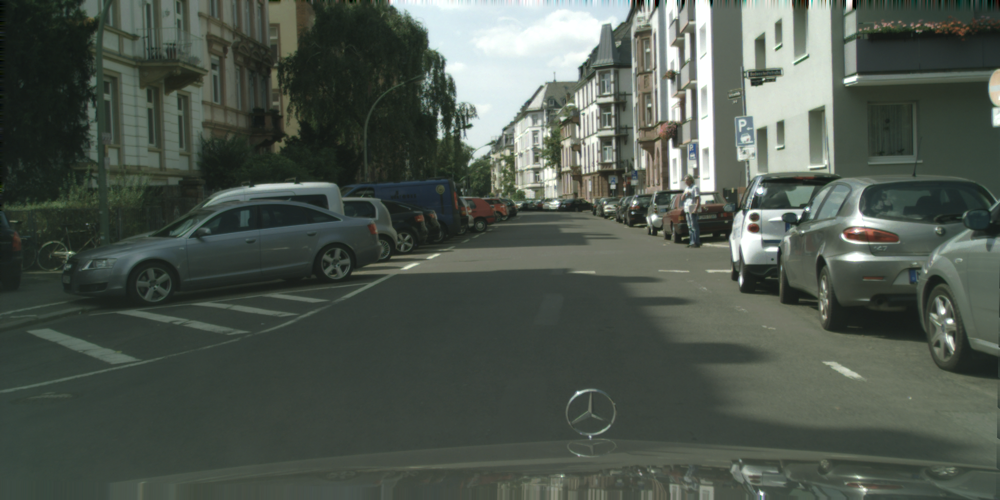
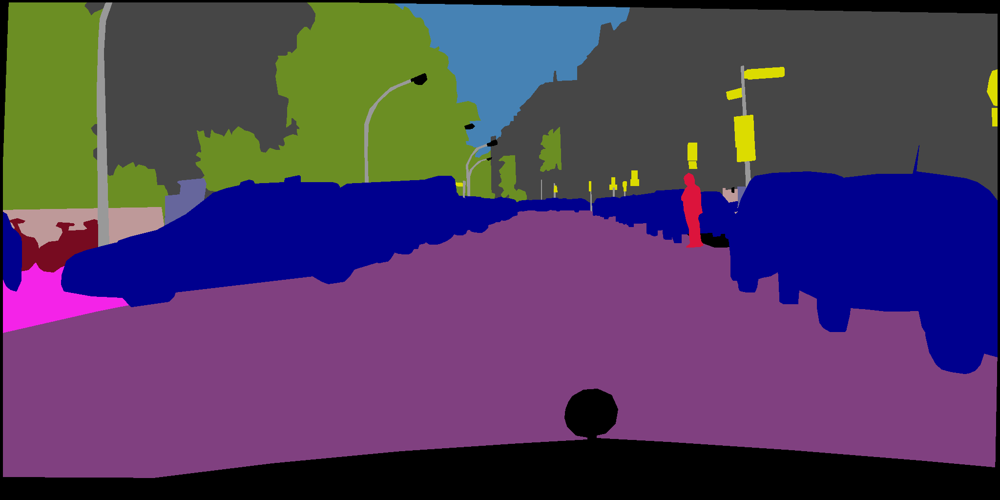
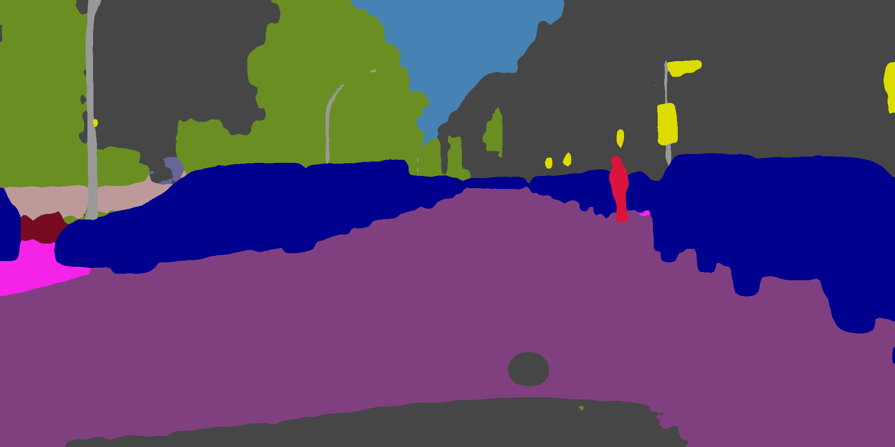

## 2. ACDC Rain

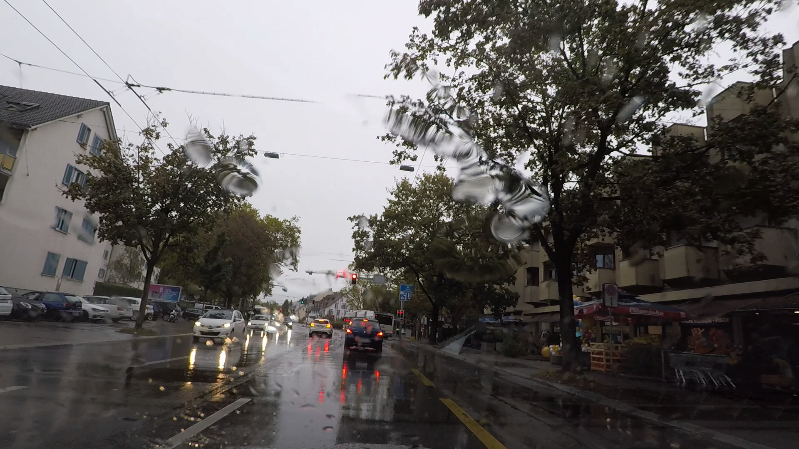
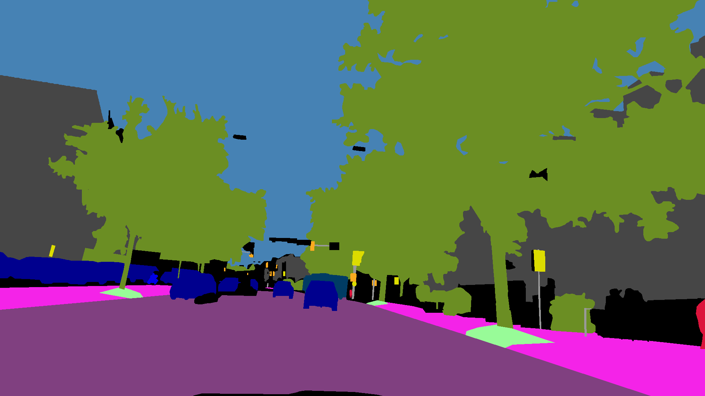

(before and after adaptation)

 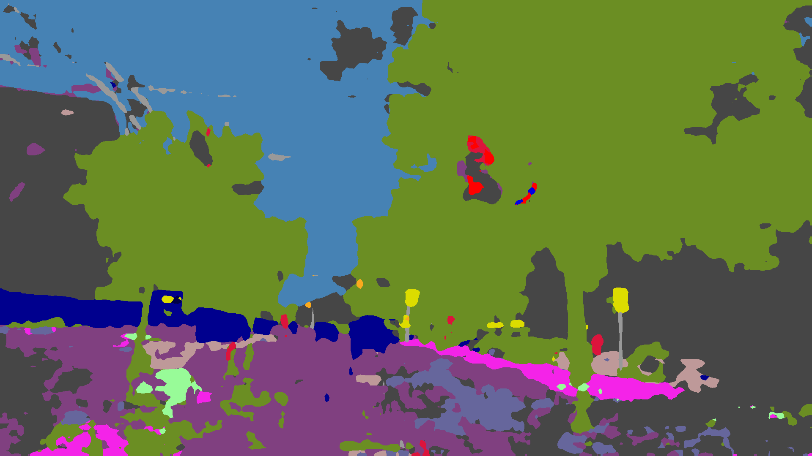
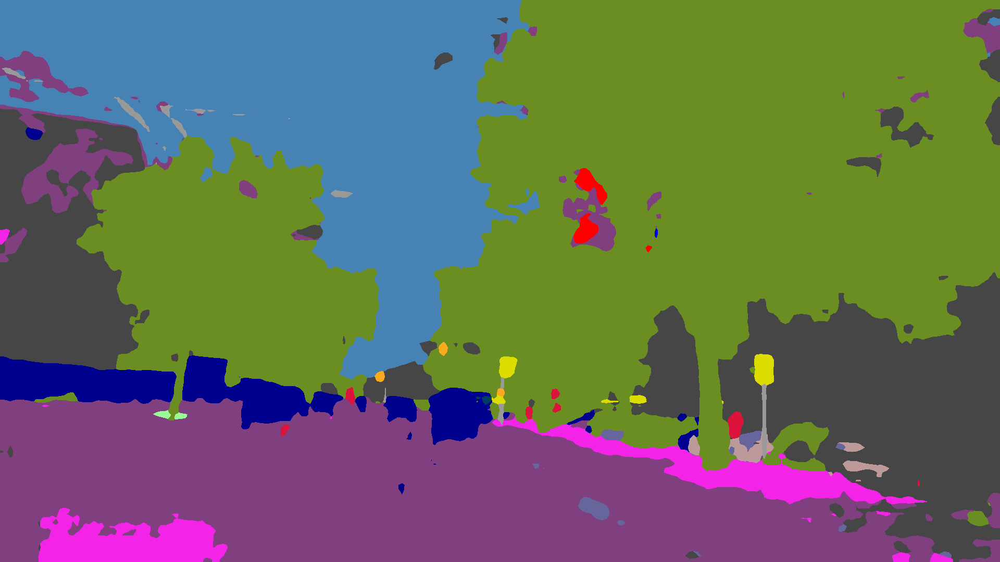

## 3. ACDC Snow

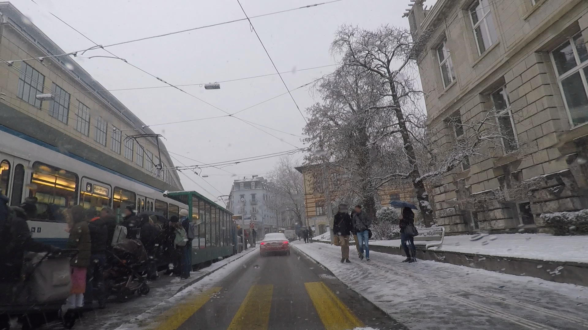
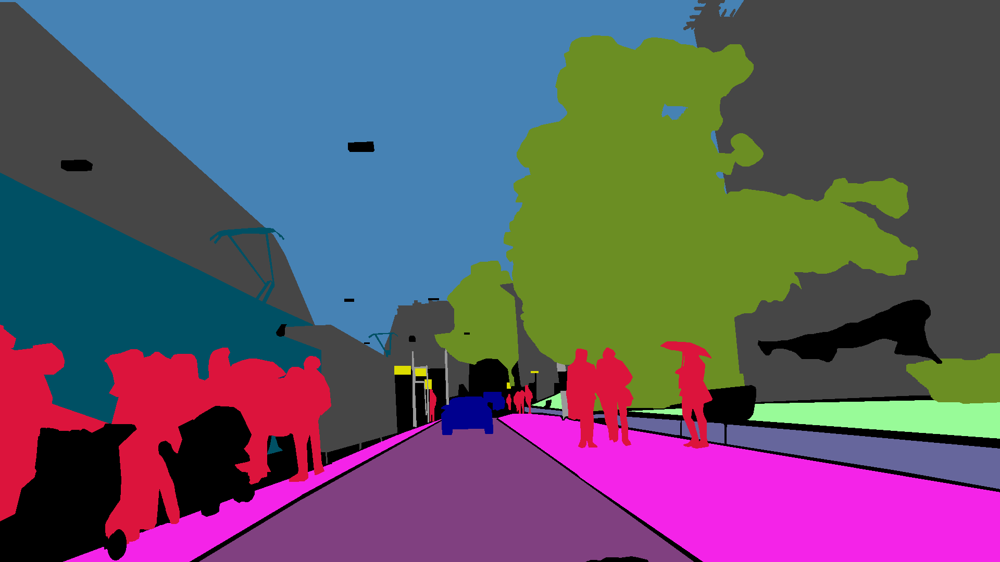

(before and after adaptation)

 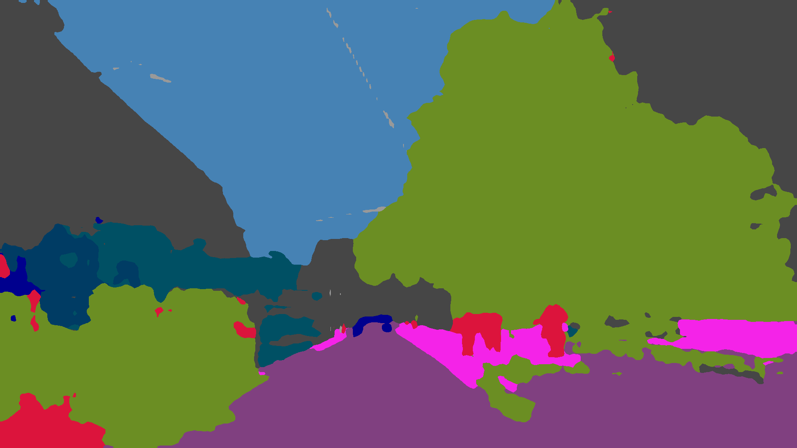
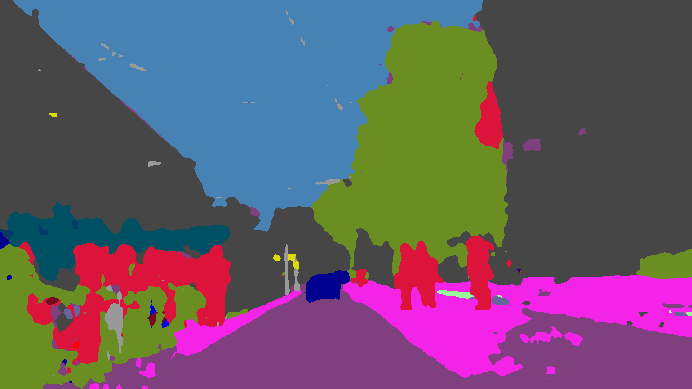

